<<<<<<< HEAD

=======

>>>>>>> origin/master
목차 {#목차 .Title1bis0}
====

[***1.*** ***문서 개요*** 1](#문서-개요)

[****1.1.**** ****목적**** 1](#목적)

[****1.2.**** ****범위**** 1](#범위)

[****1.3.**** ****참고자료**** 1](#참고자료)

[***2.*** ***관리자 대시보드 설치*** 1](#_Toc439946729)

[****2.1.**** ****관리자 대시보드 설치.**** 1](#관리자-대시보드-설치.)

[***3.*** ***관리자 대시보드 인증*** 1](#_Toc439946731)

[****3.1.**** ****관리자 대시보드 로그인****
1](#paasta-관리자-포탈-로그인)

[****3.2.**** ****관리자 대시보드 로그아웃****
1](#paasta관리자-포탈-로그아웃)

[***4.*** ***관리자 대시보드 사용자 관리***
1](#paasta-관리자-포탈-대시보드)

[****4.1.**** ****사용자 조회**** 1](#대시보드-정보-조회)

[***5.*** ***관리자 대시보드 조직 관리*** 1](#_Toc439946736)

[****5.1.**** ****조직 조회**** 1](#_Toc439946737)

[****5.2.**** ****조직 추가**** 1](#_Toc439946738)

[****5.3.**** ****조직 쿼타 설정**** 1](#조직-및-공간-조회)

[****5.4.**** ****조직 상태 변경**** 1](#_Toc439946740)

[****5.5.**** ****조직 삭제**** 1](#_Toc439946741)

[***6.*** ***관리자 대시보드 스페이스 관리*** 1](#포탈-관리)

[****6.1.**** ****스페이스 조회**** 1](#_Toc439946743)

[****6.2.**** ****스페이스 삭제**** 1](#_Toc439946744)

[***7.*** ***관리자 대시보드 애플리케이션 관리*** 1](#_Toc439946745)

[****7.1.**** ****애플리케이션 조회**** 1](#_Toc439946746)

[****7.2.**** ****애플리케이션 삭제**** 1](#_Toc439946747)

[****7.3.**** ****애플리케이션 시작**** 1](#_Toc439946748)

[****7.4.**** ****애플리케이션 정지**** 1](#_Toc439946749)

[****7.5.**** ****애플리케이션 재시작**** 1](#_Toc439946750)

[***8.*** ***관리자 대시보드 사용량 통계*** 1](#_Toc439946751)

[****8.1.**** ****사용량 추이 조회**** 1](#_Toc439946752)

[****8.2.**** ****사용량 통계 조회**** 1](#_Toc439946753)

[[]{#_Toc22051113 .anchor}]{#_Toc22051107 .anchor}

1.  문서 개요
    =========

    1.  ***목적 ***
        -----------

본 문서는 JAVA로 작성된 PaaSTA 관리자 포탈 웹 사이트를 사용하고 관리하는
방법에 대해 설명한다.

***범위***
----------

이미 설치된 PaaSTA 관리자 포탈 웹 사이트 사용하는 방법에 대해
기술하였다.

***참고자료***
--------------

[***https://github.com/OpenPaaSRnD/PaaS-TA-Portal***](https://github.com/OpenPaaSRnD/PaaS-TA-Portal)

[]{#_Toc439946729 .anchor}

***관리자 대시보드 설치.***
---------------------------

본 사용 가이드는 설치에 대한 내용은 기술하지 않았다.

관리자 대시보드의 설치는 관리자\_대시보드\_설치가이드\_v.1.0.docx 문서를
참고한다.

PaaSTA 관리자 포탈 시작
=======================

PaaSTA 관리자 포탈 웹 사이트에 접속한다.

 ***PaaSTA 관리자 포탈 로그인***
--------------------------------

1.  PaaSTA 관리자 포탈에 접속하면 인증을 위한 로그인 화면이 나타난다.

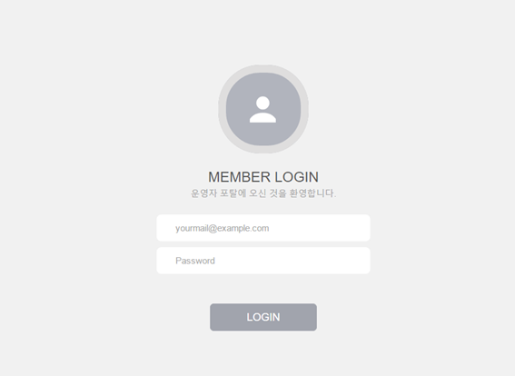

1.  아이디와 비밀번호를 입력후 LOGIN 버튼을 클릭한다.

> 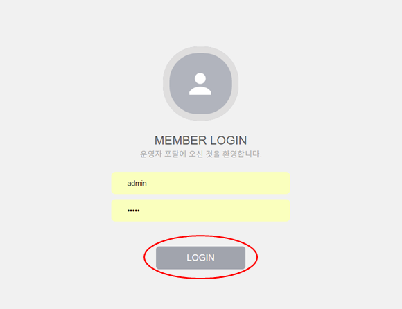

 ***PaaSTA관리자 포탈 로그아웃***
---------------------------------

1.  로그인 상태에서 메인화면 우측 상단의 로그아웃 버튼을 클릭한다.

> 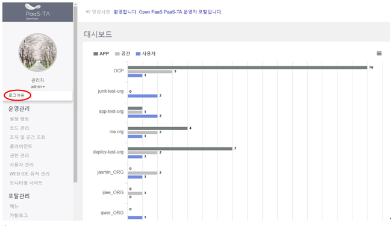

PaaSTA 관리자 포탈 대시보드
===========================

PaaSTA에 등록된 조직, 공간, APP, 사용자 통계 정보를 보여준다.

 ***대시보드 정보 조회***
-------------------------

1.  각 조직의 공간, APP, 사용자 정보를 보여준다.

> 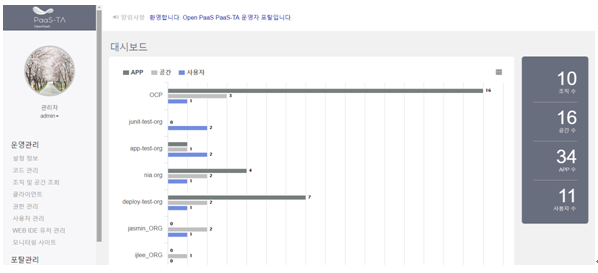

1.  조직을 클릭하면 조직의 영역 상세 정보를 확인 할 수 있다.

> 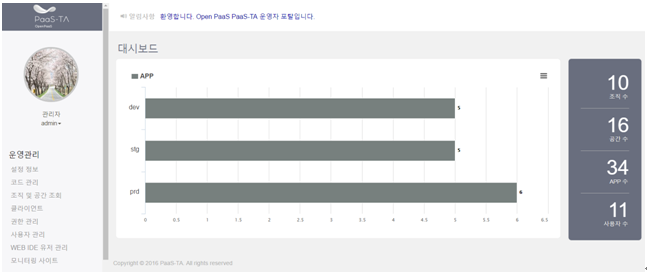

운영 관리 메뉴
==============

PaaSTA 포탈의 운영에 필요한 관리를 수행하기 위한 메뉴이다.

 ***설정 정보***
----------------

1.  PaaSTA 포탈에서 사용하는 설정 정보들을 조회한다.

> 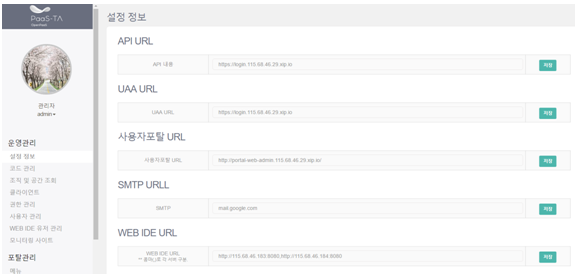

1.  PaaSTA 포탈에서 사용하는 설정 정보들을 수정하고 저장한다.

> 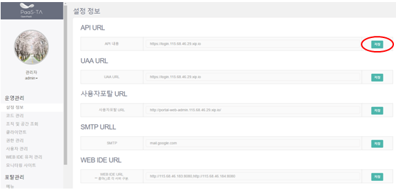

 ***코드관리***
---------------

1.  PaaSTA 포탈에서 사용하는 코드를 코드그룹별로 조회한다. 사용여부,
    검색유형, 검색어로도 조회가 가능하다.

> {width="6.413498468941382in"
> height="3.0520833333333335in"}

1.  코드 그룹의 코드 ID를 더블클릭하면 상세 코드 정보가 조회된다.

> {width="6.413888888888889in"
> height="3.2708333333333335in"}

1.  코드 그룹을 추가하기 위해 추가버튼을 누른 후 코드ID와 코드이름을
    입력하고 저장버튼을 누른다.

> {width="6.354166666666667in"
> height="2.969048556430446in"}

1.  코드를 추가하기 위해 추가버튼을 누른 후 Key, Value, 요약를 입력하고
    저장버튼을 누른다.

> 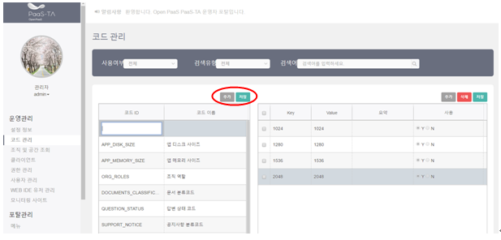{width="6.447365485564305in"
> height="2.8645833333333335in"}

1.  코드를 삭제하기 삭제할 아이템을 체크하고 삭제버튼을 누른다.

> 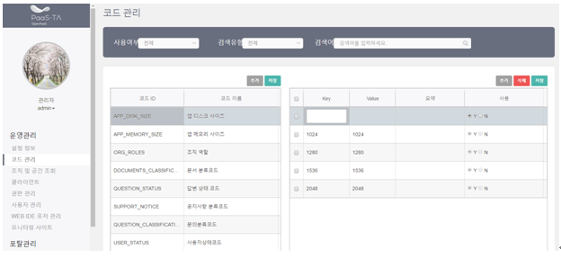{width="6.427083333333333in"
> height="2.691264216972878in"}

 ***조직 및 공간 조회***
------------------------

1.  조직과 공간을 조회한다. 검색어로 조회도 가능하다.

> 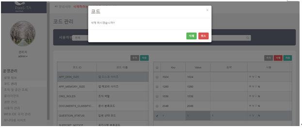{width="6.456498250218723in"
> height="2.90625in"}

1.  조직이름 옆의 상세정보 버튼을 눌러서 조직 정보를 상세 조회한다.

> 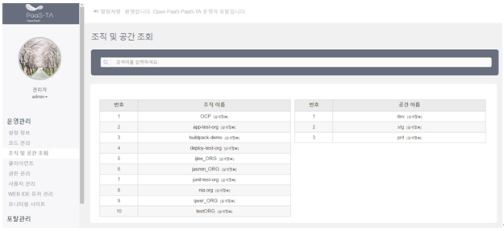{width="6.440670384951881in"
> height="2.8020833333333335in"}

1.  공간이름 옆의 상세정보 버튼을 눌러서 공간 정보를 상세조회한다.

> 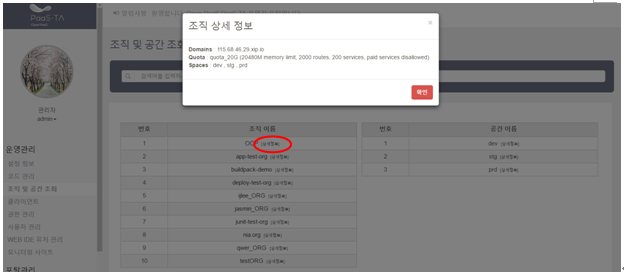{width="6.4375in"
> height="2.796955380577428in"}

 ***클라이언트***
-----------------

1.  클라이언트 목록을 조회한다.

> 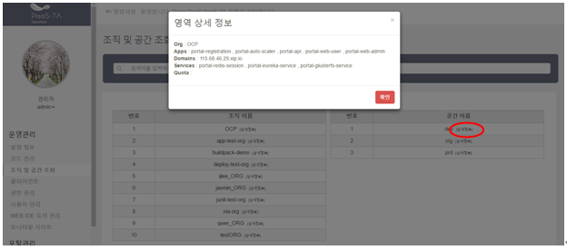{width="6.430875984251968in"
> height="3.09375in"}

1.  클라이언트 ID를 클릭하면 상세화면을 이동한다.

> 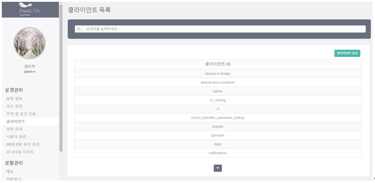{width="6.43125in"
> height="3.008665791776028in"}

1.  아이디, 패스워드, 옵션, 옵션 가이드를 입력하고 등록버튼을 눌러
    등록한다.

> 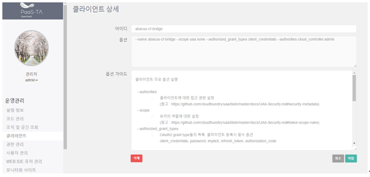{width="6.365734908136483in"
> height="3.0833333333333335in"}

 ***권한 관리***
----------------

1.  권한 그룹과 사용자를 조회한다.

> 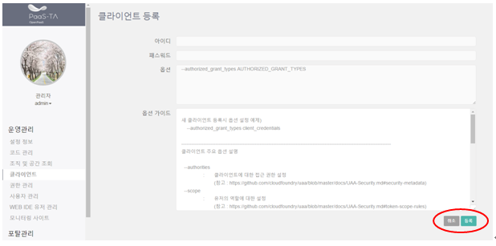{width="6.328674540682415in"
> height="3.09375in"}

1.  그룹 생성 버튼을 클릭하여 권한그룹을 생성한다.

> 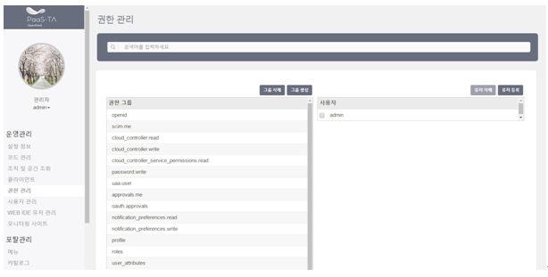{width="6.329166666666667in"
> height="2.8595122484689415in"}

1.  그룹 삭제 버튼을 클릭하여 권한그룹을 삭제한다.

> 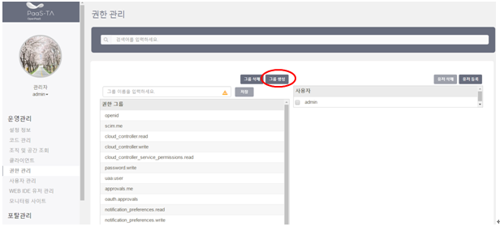{width="6.329166666666667in"
> height="2.682798556430446in"}

1.  유저 등록 버튼을 클릭하여 유저를 등록한다.

> 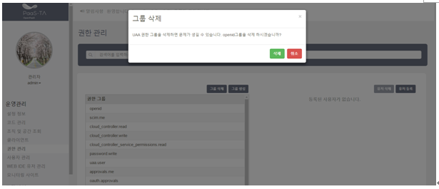{width="6.329166666666667in"
> height="2.693519247594051in"}

1.  유저 삭제 버튼을 클릭하여 유저를 삭제한다.

> 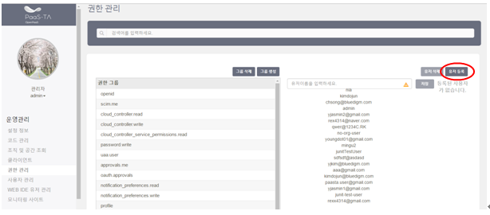{width="6.329166666666667in"
> height="2.6305096237970256in"}

 ***사용자 관리***
------------------

1.  사용자 리스트를 조회한다. 사용자 계정, 이름, 전화번호, 관리자유무,
    승인상태를 조회 할 수 있다. 검색창에서 검색어로 검색할 수 있다.

> 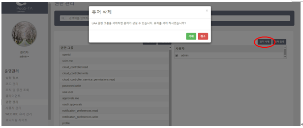{width="6.365205599300087in"
> height="3.1458333333333335in"}

1.  관리버튼를 눌러 비밀번호 초기화를 선택해 비밀번호를 초기화 한다.

> 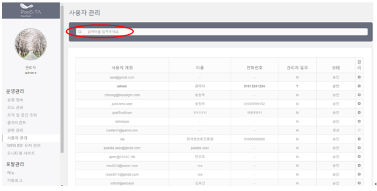{width="6.239583333333333in"
> height="2.8030008748906385in"}
>
> 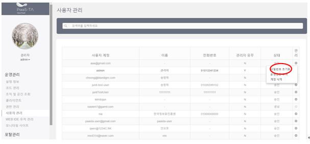{width="6.69375in"
> height="2.957404855643045in"}

1.  관리버튼를 눌러 운영권한 부여를 선택해 관리자 권한을 부여한다.

> {width="6.239583333333333in"
> height="2.8030008748906385in"}
>
> 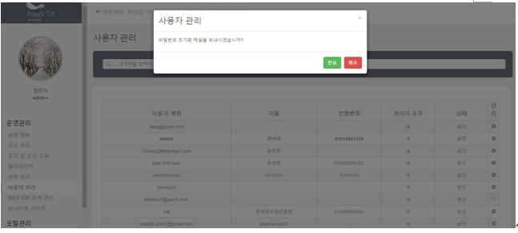{width="6.69375in"
> height="3.1314293525809274in"}

1.  관리버튼를 눌러 계정 삭제를 선택해 해당 계정을 삭제한다.

> {width="6.239583333333333in"
> height="2.8029997812773404in"}
>
> 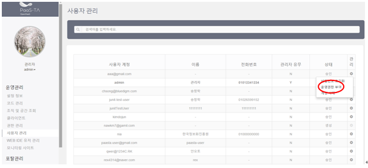{width="6.69375in"
> height="2.962667322834646in"}

 ***WEB IDE 유저 관리***
------------------------

1.  WEB IDE 신청 유저를 조회한다. 아이디, 조직, URL, 사용유무를 조회할
    수 있다.

> WEB IDE 유저관리는 조직단위로 할당 관리한다.
>
> 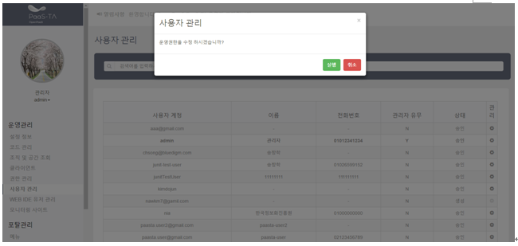{width="6.329267279090113in" height="3.0in"}

1.  WEB IDE 신청 유저의 URL과 사용유무를 지정한 후 저장버튼을 눌러
    수정해준다.

> {width="6.329861111111111in"
> height="2.6432392825896764in"}

1.  WEB IDE 신청 유저리스트에서 삭제할 회원은 삭제버튼을 눌러 삭제한다.

> 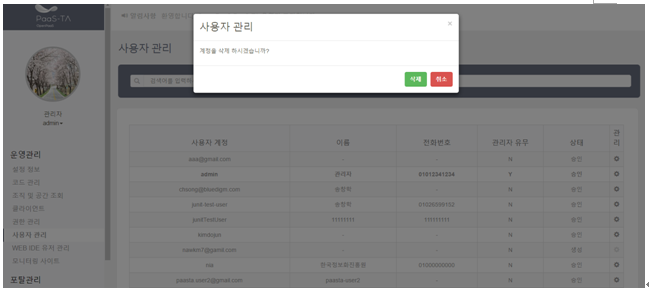{width="6.395833333333333in"
> height="2.9144280402449696in"}

 ***모니터링 사이트***
----------------------

1.  메뉴의 모니터링 사이트를 선택하면 PaaS-TA 모니터링 사이트가 새창으로
    열린다.

> PaaS-TA 모니터링 사이트는 별도의 매뉴얼을 참고한다.
>
> 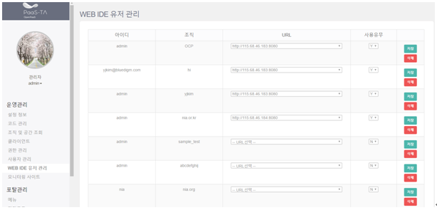{width="6.239583333333333in"
> height="3.8854166666666665in"}

포탈 관리
=========

PaaSTA 포탈의 관리에 필요한 기능을 수행하기 위한 메뉴이다.

 ***메뉴관리***
---------------

1.  PaaSTA 사용자 포탈의 상단 메뉴를 관리하는 메뉴관리 화면이다.
    메뉴트리 화면에서 메뉴를 선택 후 드래그 앤 드롭으로 메뉴의 위치를
    이동시킬 수 있다.

> 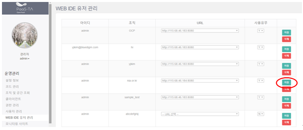{width="6.166666666666667in"
> height="2.7291666666666665in"}

1.  PaaSTA 사용자 포탈의 상단 메뉴를 생성하기 위해 메뉴 추가 버튼을
    누르고 메뉴 이름, 메뉴URL, 배치순서, 로그인여부, 사용여부를 입력하고
    저장한다.

> 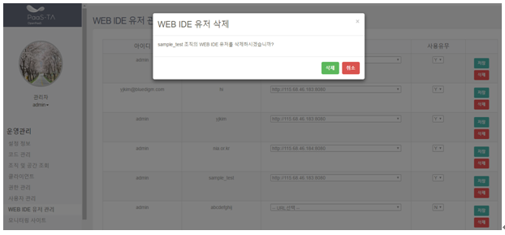{width="6.166666666666667in"
> height="2.602319553805774in"}

1.  메뉴를 삭제하기 위해 오른쪽 하단의 삭제 버튼을 누르고 삭제한다.

> 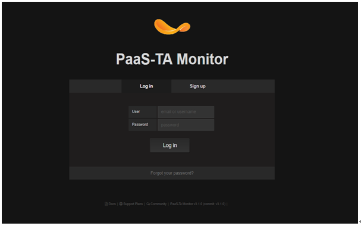{width="6.25in" height="3.1458333333333335in"}

 ***카탈로그 관리\_앱 템플릿***
-------------------------------

1.  카탈로그 앱 템플릿 목록을 조회한다. 이름, 요약, 분류, 공개여부를
    조회할 수 있다.

> 검색창에서 검색유형, 검색항목, 공개여부, 검색어로 검색이 가능하다.
>
> 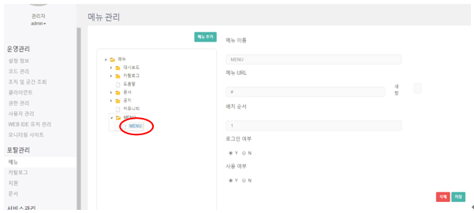{width="6.260416666666667in"
> height="3.0833333333333335in"}

1.  앱 템플릿 이름을 클릭하면 상세화면이 나온다. 수정할 내역이 있을 경우
    수정 한 후 저장버튼을 누르면 저장된다.

> 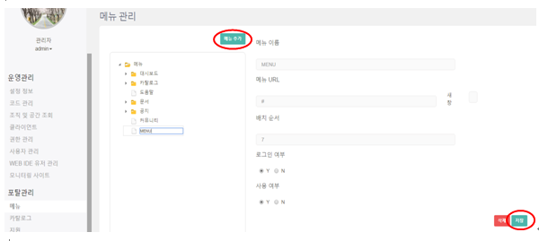{width="6.260416666666667in"
> height="3.4479166666666665in"}

1.  앱템플릿을 삭제하기 위해 왼쪽 하단의 삭제버튼을 누른다.

> {width="6.3125in" height="3.28125in"}

1.  카탈로그 화면에서 앱 템플릿을 등록하기 위해 앱 템플릿 등록버튼을
    누르면 다음의 화면이 나온다. 이름, 분류, 앱 개발환경, 서비스,
    썸네일, 공개여부, 요약, 설명을 입력하고 등록버튼을 누르면 새로운 앱
    템플릿이 등록된다.

> .
>
> 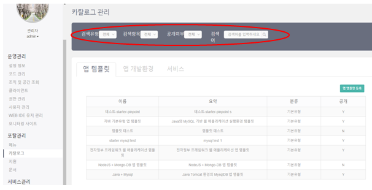{width="6.260416666666667in"
> height="3.15625in"}

 ***카탈로그 관리\_앱 개발환경***
---------------------------------

1.  카탈로그 앱 개발환경 목록을 조회한다. 이름, 요약, 분류, 공개여부를
    조회할 수 있다.

> 검색창에서 검색유형, 검색항목, 공개여부, 검색어로 검색이 가능하다.
>
> 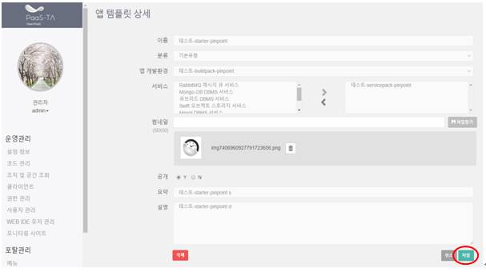{width="6.270833333333333in"
> height="3.2395833333333335in"}

1.  앱 개발환경 이름을 클릭하면 상세화면이 나온다. 수정할 내역이 있을
    경우 수정 한 후 저장버튼을 누르면 저장된다.

> 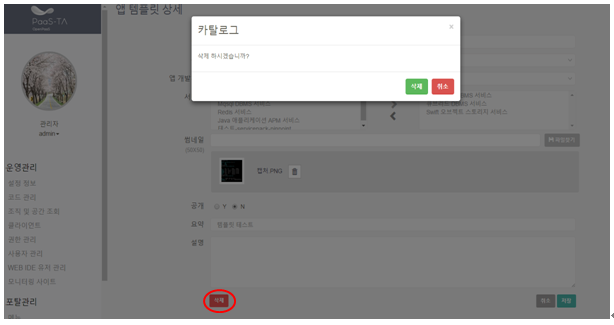{width="6.291666666666667in"
> height="3.5833333333333335in"}

1.  앱 개발환경을 삭제하기 위해 왼쪽 하단의 삭제버튼을 누른다.

> 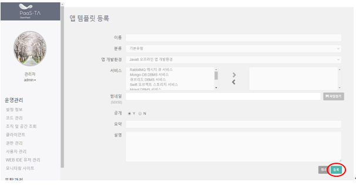{width="6.291666666666667in"
> height="3.510410104986877in"}

1.  카탈로그 화면에서 앱 개발환경을 등록하기 위해 앱 개발환경 등록버튼을
    누르면 다음의 화면이 나온다. 이름, 분류, 앱 개발환경, 서비스,
    썸네일, 공개여부, 요약, 설명을 입력하고 등록버튼을 누르면 새로운 앱
    개발환경이 등록된다.

> .
>
> 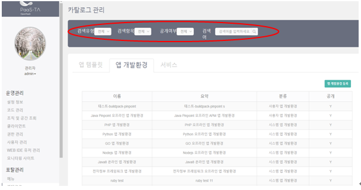{width="6.291666666666667in" height="3.25in"}

 ***카탈로그 관리\_서비스***
----------------------------

1.  카탈로그 서비스 목록을 조회한다. 이름, 요약, 분류, 공개여부를 조회할
    수 있다.

> 검색창에서 검색유형, 검색항목, 공개여부, 검색어로 검색이 가능하다.
>
> 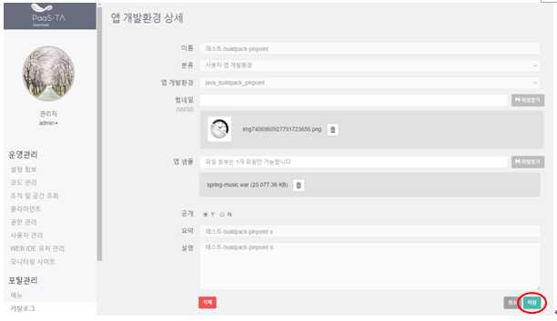{width="6.229166666666667in"
> height="3.2291666666666665in"}

1.  서비스 이름을 클릭하면 상세화면이 나온다. 수정할 내역이 있을 경우
    수정 한 후 저장버튼을 누르면 저장된다.

> 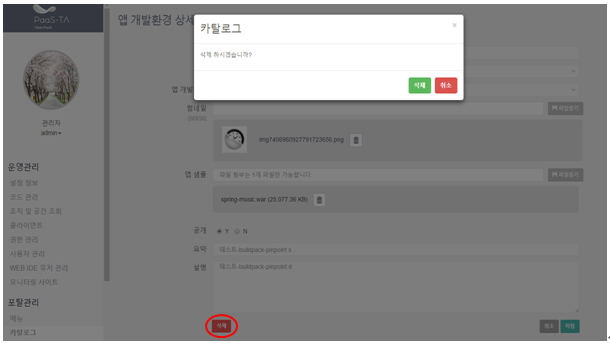{width="6.28125in"
> height="3.2708333333333335in"}

1.  서비스를 삭제하기 위해 왼쪽 하단의 삭제버튼을 누른다.

> {width="6.28125in"
> height="3.510410104986877in"}

1.  카탈로그 화면에서 서비스를 등록하기 위해 서비스 등록버튼을 누르면
    다음의 화면이 나온다. 이름, 분류, 서비스, 썸네일, 파라미터,
    공개여부, 요약, 설명을 입력하고 등록버튼을 누르면 새로운 서비스가
    등록된다.

> .
>
> 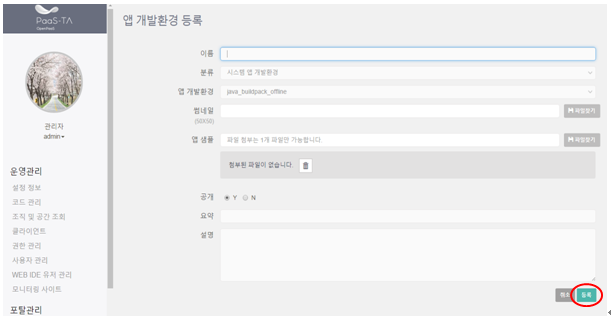{width="6.28125in"
> height="3.1458333333333335in"}

 ***지원\_공지***
-----------------

1.  공지 목록을 조회한다. 번호, 분류, 제목, 게시일, 분류, 공개여부를
    조회할 수 있다.

> 검색창에서 게시일, 검색항목, 공개여부, 검색어로 검색이 가능하다.
>
> 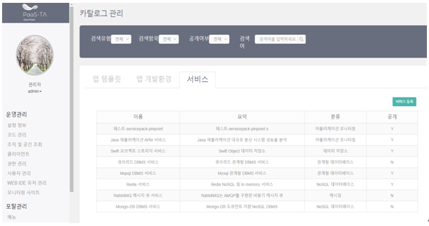{width="6.28125in"
> height="3.2068274278215223in"}

1.  게시물을 클릭하면 상세화면이 나온다. 수정할 내역이 있을 경우 수정 한
    후 둥록버튼을 누르면 수정된다.

> 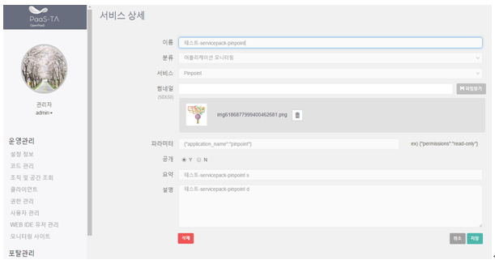{width="6.28125in"
> height="3.0520833333333335in"}

1.  공지 게시판 리스트 화면에서 공지를 등록하기 위해 공지등록버튼을
    누르면 다음의 화면이 나온다. 제목, 분류, 공개여부, 내용, 첨부파일,
    게시일을 입력하고 등록버튼을 누르면 새로운 서비스가 등록된다.

> 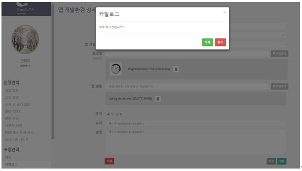{width="6.333333333333333in"
> height="3.1041666666666665in"}

 ***지원\_문의***
-----------------

1.  문의 목록을 조회한다. 번호, 분류, 제목, 작성자, 게시일, 답변을
    조회할 수 있다.

> 검색창에서 게시일, 검색항목, 답변여부, 검색어로 검색이 가능하다.
>
> 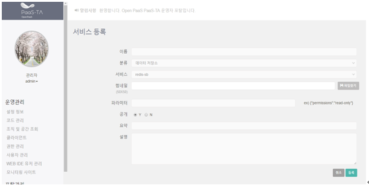{width="6.375in"
> height="2.8020833333333335in"}

1.  게시물을 클릭하면 문의 상세화면이 나온다. 답변할 내역이 있을 경우
    수정 한 후 둥록버튼을 누르면 수정된다.

> 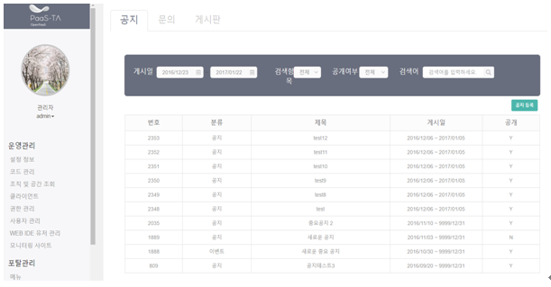{width="6.28125in"
> height="3.3630686789151354in"}

***지원\_게시판***
------------------

1.  게시판 목록을 조회한다. 분류, 제목, 게시일, 분류, 공개여부를 조회할
    수 있다.

> 검색창에서 게시일, 검색항목, 공개여부, 검색어로 검색이 가능하다.
>
> 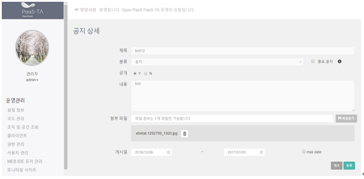{width="6.28125in"
> height="2.655847550306212in"}

1.  게시물을 클릭하면 상세화면이 나온다. 제목, 작성자, 내용, 첨부파일,
    댓글을 볼 수 있다.

> 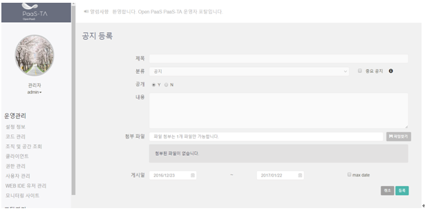{width="6.28125in" height="2.8125in"}

1.  게시물을 삭제하려면 상세화면의 왼쪽 하단의 삭제버튼을 누르면
    삭제된다.

> 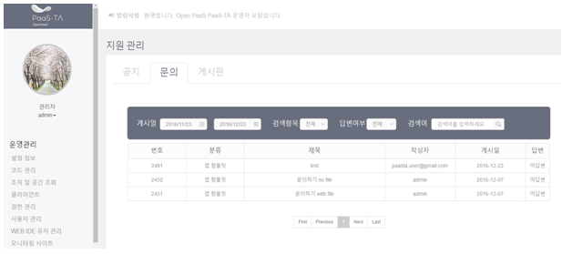{width="6.3125in" height="2.65625in"}

***문서관리***
--------------

1.  문서관리 목록을 조회한다. 번호, 분류, 제목, 적성자, 게시일,
    공개여부를 조회할 수 있다.

> 검색창에서 게시일, 검색항목, 공개여부, 검색어로 검색이 가능하다.
>
> {width="6.208333333333333in"
> height="2.4166666666666665in"}

1.  게시물을 클릭하면 상세화면이 나온다. 제목, 작성자, 내용, 첨부파일,
    댓글을 볼 수 있다. 수정할 내역이 있을 경우 수정 한 후 저장버튼을
    누르면 수정된다.

> 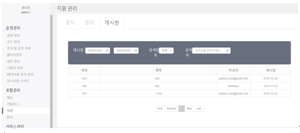{width="6.208333333333333in" height="3.125in"}

1.  게시물을 삭제하려면 상세화면의 왼쪽 하단의 삭제버튼을 누르면
    삭제된다.

> {width="6.3125in" height="3.0625in"}

1.  문서 게시판 리스트 화면에서 문서를 등록하기 위해 문서등록버튼을
    누르면 다음의 화면이 나온다. 제목, 분류, 공개여부, 내용, 첨부파일을
    입력하고 등록버튼을 누르면 새로운 서비스가 등록된다.

> {width="6.3125in"
> height="2.7916666666666665in"}

서비스 관리
===========

PaaSTA 포탈의 서비스 관리를 수행하기 위한 메뉴이다.

 ***빌드팩***
-------------

1.  PaaSTA 포탈에서 사용하는 빌드팩 정보들을 조회한다.

> {width="6.25in" height="2.8333333333333335in"}

1.  빌드팩 순서를 변경하기 위해 순서 콤보박스를 변경한다.

> {width="6.25in" height="2.8333333333333335in"}

1.  빌드팩 사용유무를 변경하기 위해 사용유무 체크박스를 변경한다.

> {width="6.25in" height="2.8333333333333335in"}

1.  빌드팩 Lock유무를 변경하기 위해 Lock 체크박스를 변경한다.

> {width="6.25in" height="2.8333333333333335in"}

***6.2 서비스 브로커***
-----------------------

1.  PaaSTA 포탈에서 사용하는 서비스 브로커 내역을 조회한다.

> {width="6.3125in"
> height="1.9879079177602799in"}

1.  이름을 클릭하면 서비스 브로커 상세를 볼 수 있다. 수정할 내역이 있을
    경우 수정 한 후 저장버튼을 누르면 수정된다.

> {width="6.385416666666667in"
> height="2.228063210848644in"}

1.  상세화면에서 왼쪽 하단 삭제 버튼을 누르면 삭제된다.

> {width="6.69375in"
> height="3.013354111986002in"}

1.  서비스 브로커 리스트 화면에서 등록버튼을 누르면 아래와 같은
    등록화면이 나온다. 서비스 브로커 이름, 사용자 이름, 사용자 패스워드,
    URL 정보를 입력하고 등록버튼을 누르면 등록된다.

> {width="6.69375in"
> height="2.3500831146106735in"}
